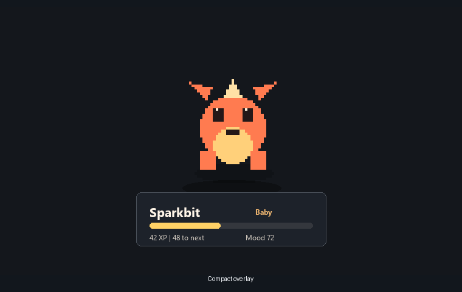
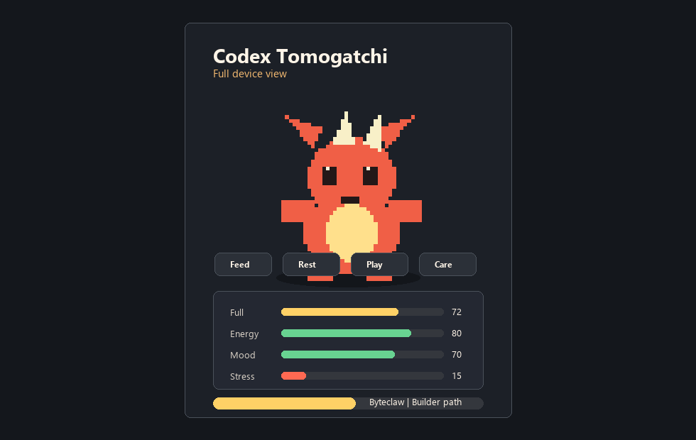
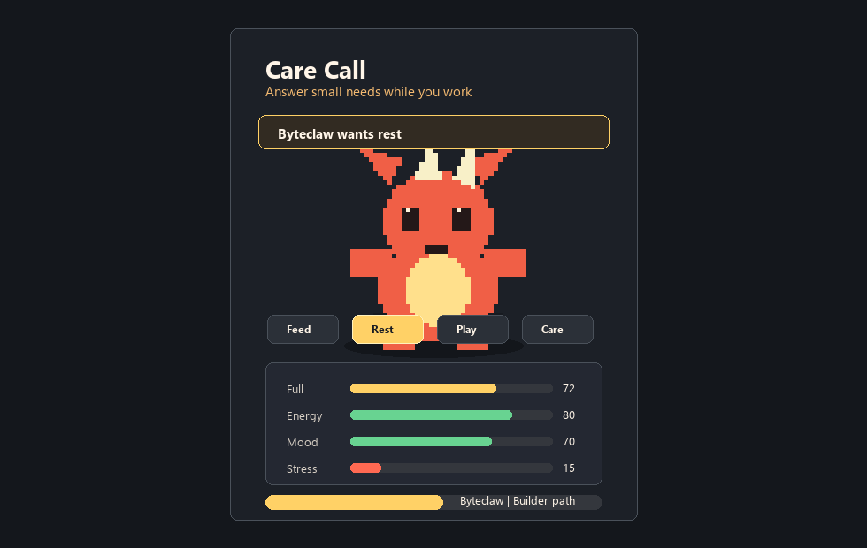
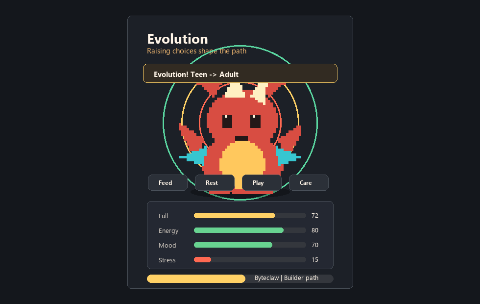

# Codex Tomogatchi

A local virtual pet for Codex. It watches privacy-safe local activity counters, turns them into XP and care needs, and shows the pet in a live desktop overlay.



## Status

Codex Tomogatchi is a public alpha.

- Windows installer: [download Codex-Tomogatchi-Windows-Setup.exe](https://github.com/M0hamedd/codex-tomogatchi/releases/latest/download/Codex-Tomogatchi-Windows-Setup.exe).
- Source install: clone this repo and run the setup script below.
- npm publishing is intentionally disabled.
- Windows builds are currently unsigned, so Windows may show trust prompts.
- State is local-only. There is no cloud sync.

## Install In 60 Seconds

Windows installer:

1. Download [Codex-Tomogatchi-Windows-Setup.exe](https://github.com/M0hamedd/codex-tomogatchi/releases/latest/download/Codex-Tomogatchi-Windows-Setup.exe).
2. Run the installer.
3. Open Codex Tomogatchi from the Start menu or tray.

Known alpha limits:

- Windows installers are unsigned, so Windows may show trust prompts.
- Codex custom pet sync may require restarting or refreshing Codex.
- State stays local. There is no cloud sync.

## Source Install

Requirements:

- Python 3
- Node.js 22 or newer with npm 10 or newer
- Codex Desktop or Codex CLI writing session logs under `${CODEX_HOME:-~/.codex}/sessions`

Windows:

```powershell
git clone https://github.com/M0hamedd/codex-tomogatchi.git
cd codex-tomogatchi
npm ci
python -m pip install -r requirements-dev.txt
.\scripts\setup.ps1
```

macOS/Linux source path:

```bash
git clone https://github.com/M0hamedd/codex-tomogatchi.git
cd codex-tomogatchi
npm ci
python3 -m pip install -r requirements-dev.txt
./scripts/setup.sh
```

The setup script installs dependencies, initializes local settings, checkpoints existing Codex logs, installs the current pet stage, and starts the overlay.

The npm commands automatically look for Python 3 in this order: `PYTHON`, `python`, `python3`, then Windows `py -3`.
Most command examples use PowerShell paths; on macOS/Linux, use `python3` and `/` paths.

Manual start:

```powershell
npm install
py -3 plugins/codex-tomogatchi/scripts/tomogatchi.py settings --init
py -3 plugins/codex-tomogatchi/scripts/tomogatchi.py reset --confirm --from-now
py -3 plugins/codex-tomogatchi/scripts/tomogatchi.py install
npm start
```

Use `python3` instead of `py -3` on macOS/Linux.

## What You Get

- Live Electron overlay with compact mode, full device mode, tray menu, resizing, and reactions.
- Original default pet line: Sparkbit -> Byteclaw -> Coremaw.
- XP from Codex activity, with local-only counters.
- Care calls for `feed`, `rest`, `play`, and `comfort`.
- Evolution based on care, missed calls, mistakes, and work focus.
- Optional sync into Codex custom pets.
- Asset-only custom pet packs.

## Important Limits

- The overlay is the main live experience. Codex custom pet sync is optional and may require restarting or refreshing Codex before the selected pet changes there.
- Tracking depends on local Codex JSONL session logs. If Codex changes its log path or schema, tracking may miss activity until this parser is updated.
- The app stores aggregate counters and checkpoints, not prompt text, command text, tool output, screenshots, raw session logs, or project file contents.

See [PRIVACY.md](PRIVACY.md).

## Common Commands

Short npm wrappers:

```powershell
npm run status
npm run doctor
npm run care -- feed
npm run care -- rest
npm run care -- play
npm run care -- comfort
npm run sync
npm run backup
```

Direct Python commands:

```powershell
py -3 plugins/codex-tomogatchi/scripts/tomogatchi.py status
py -3 plugins/codex-tomogatchi/scripts/tomogatchi.py doctor
py -3 plugins/codex-tomogatchi/scripts/tomogatchi.py care feed
py -3 plugins/codex-tomogatchi/scripts/tomogatchi.py care rest
py -3 plugins/codex-tomogatchi/scripts/tomogatchi.py care play
py -3 plugins/codex-tomogatchi/scripts/tomogatchi.py care comfort
py -3 plugins/codex-tomogatchi/scripts/tomogatchi.py sync
py -3 plugins/codex-tomogatchi/scripts/tomogatchi.py watch
```

Useful maintenance:

```powershell
py -3 plugins/codex-tomogatchi/scripts/tomogatchi.py settings
py -3 plugins/codex-tomogatchi/scripts/tomogatchi.py backup create
py -3 plugins/codex-tomogatchi/scripts/tomogatchi.py backup list
py -3 plugins/codex-tomogatchi/scripts/tomogatchi.py backup restore C:\path\backup.zip --confirm
```

`doctor` checks local setup. Backups include Tomogatchi state and settings only; they do not include raw Codex logs.

## Settings

Settings live at:

```text
${CODEX_HOME:-~/.codex}/codex-tomogatchi/settings.json
```

Examples:

```powershell
py -3 plugins/codex-tomogatchi/scripts/tomogatchi.py settings xp.pace slow
py -3 plugins/codex-tomogatchi/scripts/tomogatchi.py settings care.callStrictness relaxed
py -3 plugins/codex-tomogatchi/scripts/tomogatchi.py settings lifecycle.deathEnabled false
py -3 plugins/codex-tomogatchi/scripts/tomogatchi.py settings overlay.startMode full
```

## Custom Pet Packs

Pet packs are asset-only folders or zip files. They cannot run scripts. They install into:

```text
${CODEX_HOME:-~/.codex}/codex-tomogatchi/pet-packs/<pack-id>/
```

Basic layout:

```text
my-pet-line.zip
  pack.json
  stages/
    baby/
      pet.json
      spritesheet.webp
    teen/
      pet.json
      spritesheet.webp
    adult/
      pet.json
      spritesheet.webp
```

Pack commands:

```powershell
py -3 plugins/codex-tomogatchi/scripts/tomogatchi.py pets list
py -3 plugins/codex-tomogatchi/scripts/tomogatchi.py pets forms
py -3 plugins/codex-tomogatchi/scripts/tomogatchi.py pets import C:\path\my-pet-line.zip --select
py -3 plugins/codex-tomogatchi/scripts/tomogatchi.py pets validate C:\path\my-pet-line.zip
py -3 plugins/codex-tomogatchi/scripts/tomogatchi.py pets export my-pet-line --output C:\path\my-pet-line.zip
py -3 plugins/codex-tomogatchi/scripts/tomogatchi.py pets select default
```

Branching packs can define multiple forms per stage and choose evolution paths from requirements. The bundled examples are:

- `examples/pet-packs/digimon-world-1-agumon`: a Digimon World 1-style branching rules example with generated concept sprites.
- `examples/pet-packs/tuxemon-open-61`: a 61-form Tuxemon-derived example using GPL-3.0-or-later source data and generated concept sprites.

Use a branching starter:

```powershell
py -3 plugins/codex-tomogatchi/scripts/tomogatchi.py pets import examples\pet-packs\digimon-world-1-agumon --replace --select
py -3 plugins/codex-tomogatchi/scripts/tomogatchi.py pets forms
py -3 plugins/codex-tomogatchi/scripts/tomogatchi.py pets hatch agumon
```

`pets hatch <baby-form-id>` resets to baby and checkpoints existing Codex logs by default, so old history does not instantly evolve the new starter.

## Screenshots







Refresh static previews with:

```powershell
python scripts/render_overlay_preview.py
```

Use `python3 scripts/render_overlay_preview.py` on systems where the Python executable is named `python3`.

Do not include prompt text, command text, tool output, raw logs, project files, or private workspace details in release screenshots.

## Build

Windows release check:

```powershell
npm ci
python -m pip install -r requirements-dev.txt
npm test
npm run package
npm run dist:win
```

macOS/Linux local check:

```bash
npm ci
python3 -m pip install -r requirements-dev.txt
npm test
npm run package
```

GitHub release builds use the same locked `electron-builder` dependency, install `requirements-dev.txt`, run `npm test`, build Windows artifacts with `npm run dist:win -- --publish never`, and publish the installer, zip, update metadata, and stable installer alias. Current Windows artifacts are unsigned alpha builds.

## More Docs

- [Setup](docs/SETUP.md)
- [Privacy](PRIVACY.md)
- [Contributing](CONTRIBUTING.md)
- [Third-party notices](THIRD_PARTY_NOTICES.md)

## License

Repository code is MIT. See [LICENSE](LICENSE).

Example pet packs can include separate source-data, asset, or trademark terms. See [THIRD_PARTY_NOTICES.md](THIRD_PARTY_NOTICES.md) and each pack's `SOURCE.md` or `pack.json` source block.
